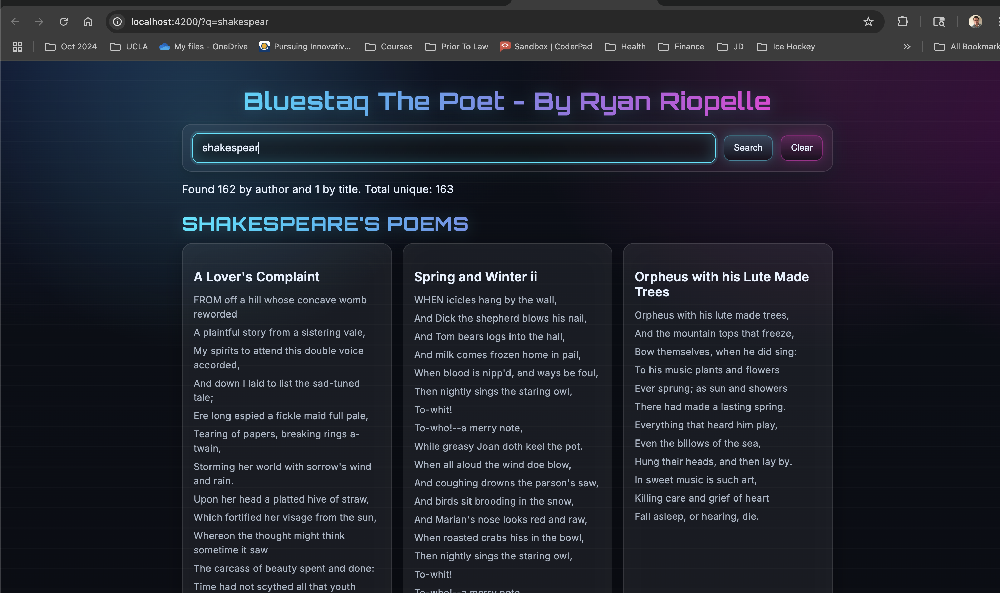
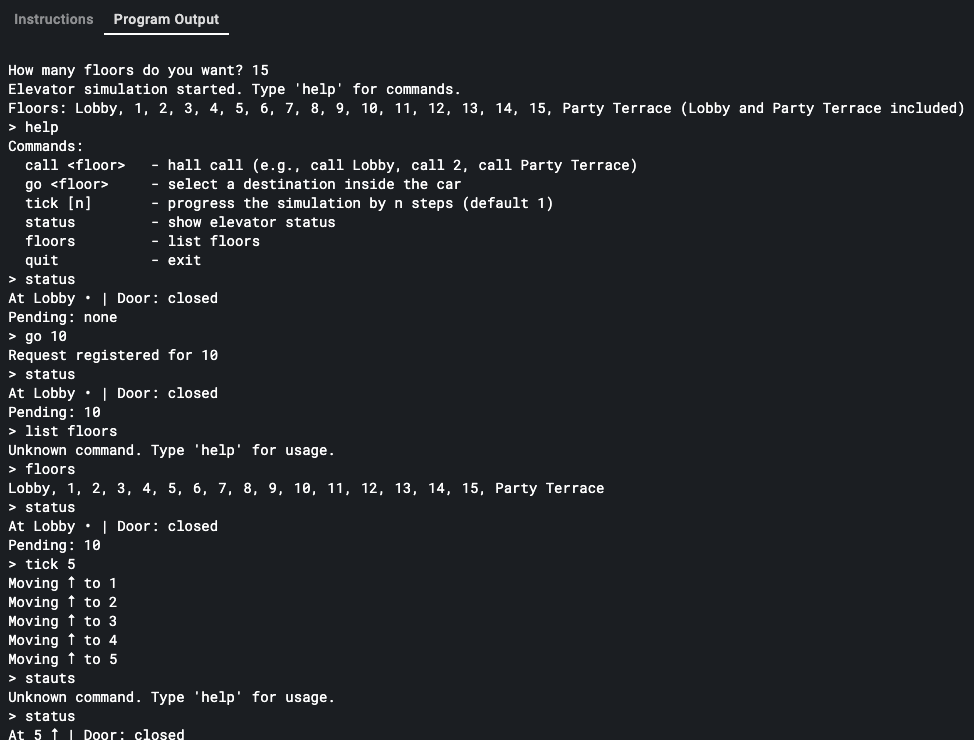

 
# Code Challenge

## The Poet(Front-End)

Using Angular if possible or JavaScript or typescript, complete the following and be ready to execute and explain your work during the interview:
1. Review the  https://poetrydb.org/ api.
2. Write a script or webpage to make rest calls to the server (author and title endpoint) and inspect the response.
3. The script should throw an error if a 200 is not received.
4. Enhance the script to retrieve both author and title by name and log all relevant data.
5. Be prepared to expand the functionality of your solution during the interview.

### Ryans Solution - How it works
- Main files are in [app.component.ts](./src/appapp.component.ts), .html, .css, ect.
- As you type, input is debounced (400ms) and searches run automatically.
- The URL is kept in sync (?q=...), so you can copy/share the link and get the same results on load.
- Hitting Enter triggers an immediate search (skips the debounce).
 

## The Elevator(Back-End)
 

Provide code that simulates an elevator.  You may use any language (recommend using Java or Python). 
Please upload your code Git Hub for a discussion during your interview with our team.
Additionally, document all assumptions and any features that weren't implemented.
Please be prepared to discuss the assumptions and features that were not implemented during your interview!

### Ryans Solution
[Elevator Simulation Code Solution](data_backend_elevator.py)

